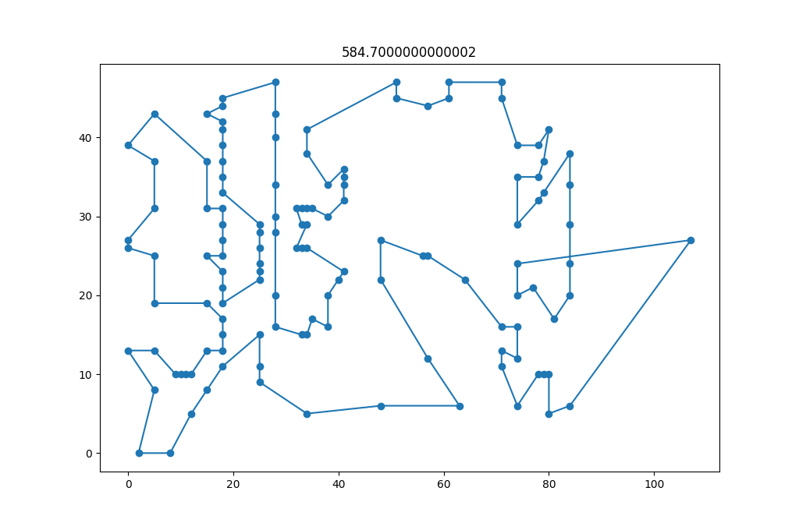

# EC_lab2_TSP

1. Утилита 1_TSP_gen.py преобразует *.tsp файл(немного измененный - удален префикс, добавлен заголовок) в матрицу расстояний(Matrix.p).
2. TSP.py(использует модуль genetic_algorithm.py) считывает Matrix.p и ищет кратчайший тур. Лучший из туров можно скопировать из окна консоли.
3. TSP_viz.py визуализирует тур. Тур задается в переменной way, в коде.

# Кратчайший тур



Лучший тур, но с длинной дугой


Лучший результат на сайте = 564.

Полученный результат = 584.

http://www.math.uwaterloo.ca/tsp/vlsi/xqf131.tour.html

```python
way = [11, 4, 10, 9, 3, 2, 8, 7, 1, 6, 12, 5, 13, 18, 14, 15, 16, 17, 25, 26, 27, 19, 20, 21, 22, 23, 24, 44, 43, 42, 41, 40, 39, 38, 37, 36, 35, 34, 33, 32, 31, 30, 29, 28, 46, 45, 53, 74, 68, 64, 54, 55, 47, 48, 49, 50, 51, 52, 57, 56, 62, 65, 69, 66, 70, 76, 71, 67, 63, 58, 59, 60, 61, 73, 72, 80, 79, 83, 84, 85, 86, 90, 91, 95, 96, 97, 104, 103, 111, 110, 99, 94, 92, 88, 87, 82, 81, 78, 75, 77, 89, 93, 98, 100, 105, 101, 102, 106, 107, 113, 108, 109, 115, 119, 116, 120, 117, 122, 129, 128, 127, 126, 125, 124, 121, 118, 114, 112, 123, 130, 131] #560. (best=564)

way = [131, 130, 123, 121, 118, 114, 112, 100, 101, 105, 106, 102, 99, 94, 92, 88, 87, 93, 98, 89, 74, 53, 45, 46, 26, 25, 18, 13, 5, 12, 1, 6, 14, 15, 16, 17, 19, 27, 28, 29, 20, 7, 8, 2, 3, 9, 10, 4, 11, 23, 22, 36, 35, 34, 33, 21, 32, 31, 30, 47, 48, 49, 50, 51, 52, 37, 38, 39, 40, 41, 42, 24, 43, 44, 61, 60, 59, 58, 57, 56, 55, 54, 64, 68, 75, 77, 78, 81, 82, 69, 65, 62, 70, 66, 63, 67, 71, 76, 79, 83, 84, 85, 86, 80, 72, 73, 91, 90, 95, 96, 97, 104, 103, 111, 117, 122, 120, 116, 110, 109, 115, 119, 129, 128, 127, 126, 125, 124, 113, 107, 108] #584. (best=564)
```

# Эволюция

Особенности:
1. для каждого поколения добавляем новых особей. новые случайные особи могут иметь последовательность, которая может улучшить score, поэтому, позволяем им участвовать в кросс-овере.
```
for kk in range(0,30):
	parents.append(individual())
```
2. Сохраняем трех лучших родителей перед мутацией
```
saving = parents[:3]
```

3. Популяция мутирует после кросс-овера, вместе с потомками. 3 родителя не мутируют.

# Мутации

```
  #Перемещивание произвольно выбранной части
	if seed==0:
		idx1 = random.randint(0, len(individual)-2)
		idx2 = random.randint(idx1+1, min(idx1+55, len(individual)-1))
		
		col = individual[idx1:idx2]
		random.shuffle(col)
		individual[idx1:idx2]=col
	
  #Обмен двух случайных элементов
	elif seed==1:
		#swap
		idx1 = random.randint(0, len(individual)-1)
		idx2 = random.randint(0, len(individual)-1)
		
		tmp = individual[idx1]
		
		individual[idx1] = individual[idx2]
		individual[idx2] = tmp
	
  #Обмен двух случайных пар
	elif seed==2:
		#swap 2
		idx1 = random.randint(0, len(individual)-2)
		idx2 = random.randint(0, len(individual)-2)
		if abs(idx2-idx1)>5:
			col1 = individual[idx1:idx1+1]
			col2 = individual[idx2:idx2+1]
			individual[idx2:idx2+1] = col1
			individual[idx1:idx1+1] = col2
  #Оборачивание участка
	elif seed==3:
		#reverse part
		idx1 = random.randint(0, len(individual)-2)
		idx2 = random.randint(idx1+1, len(individual)-1)

		col = individual[idx1:idx2]
		
		individual[idx1:idx2]=reversed(col)
	
  #Сортировка участка
	elif seed==4:
		#sort part
		idx1 = random.randint(0, len(individual)-2)
		idx2 = random.randint(idx1+1, len(individual)-1)

		col = individual[idx1:idx2]
		
		individual[idx1:idx2]=sorted(col)
	
  #Извлечение участка и вставка его в произвольном месте
	elif seed==5:
		
		par = copy.deepcopy(individual)
		
		#big swap
		idx1 = random.randint(0, len(individual)-2)
		idx2 = random.randint(idx1+1, len(individual)-1)
		
		col = individual[idx1:idx2]
		individual[idx1:idx2] = [] #remove part
		
		idx3 = random.randint(0, len(individual))
		individual[idx3:idx3] = col
  
  #два последовательных случайных обмена
	elif seed==6:
		#double swap
		idx1 = random.randint(0, len(individual)-1)
		idx2 = random.randint(0, len(individual)-1)
		
		tmp = individual[idx1]
		
		individual[idx1] = individual[idx2]
		individual[idx2] = tmp
		
		idx1 = random.randint(0, len(individual)-1)
		idx2 = random.randint(0, len(individual)-1)
		
		tmp = individual[idx1]
		
		individual[idx1] = individual[idx2]
		individual[idx2] = tmp
  
  #выбор двух случайных элементов и размещение их подряд в случайном месте
	elif seed==7:
		#select random two, put them at selected place
		elts=[]
		elts.append(individual.pop(random.randint(0,len(individual)-1)))
		elts.append(individual.pop(random.randint(0,len(individual)-1)))
		
		idx1 = random.randint(0, len(individual)-1)
		
		individual[idx1:idx1] = elts
```

# Кроссовер

```
def crossover(parent1, parent2):

	#Инициализация массива
	child = [0]*len(parent1)
	
	#Пустой массив, заполненный None
	for x in range(0,len(child)):
		child[x] = None

	start_pos = random.randint(0,len(parent1))
	end_pos = random.randint(0,len(parent1))
  
  #наследование части элементов первого родителя
	if start_pos < end_pos:
		# start->end
		for x in range(start_pos,end_pos):
			child[x] = parent1[x]
	elif start_pos > end_pos:
		#end->start
		for i in range(end_pos,start_pos):
			child[i] = parent1[i]

	#замена оставшихся None элементами второго родителя
	for i in range(len(parent2)):
		if not parent2[i] in child:
			for x in range(len(child)):
				if child[x] == None:
					child[x] = parent2[i]
					break

	return child
```

# Fitness-функция

Оценка тура имеет вид: 913.82

```
def fitness(individual):
	
	#sum
	cost = 0
	
	for i in range(0, len(individual)-1):
		cost += distMatrix[individual[i]][individual[i+1]]
	cost += distMatrix[len(individual)-1][0]
	
	return cost
```

# Генерация особи

```
def individual():
	lst = list(range(1,len(distMatrix)))
  #случайное перемешивание
	random.shuffle(lst)
	
	return lst
```
